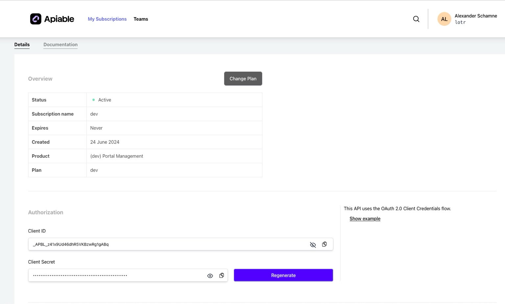
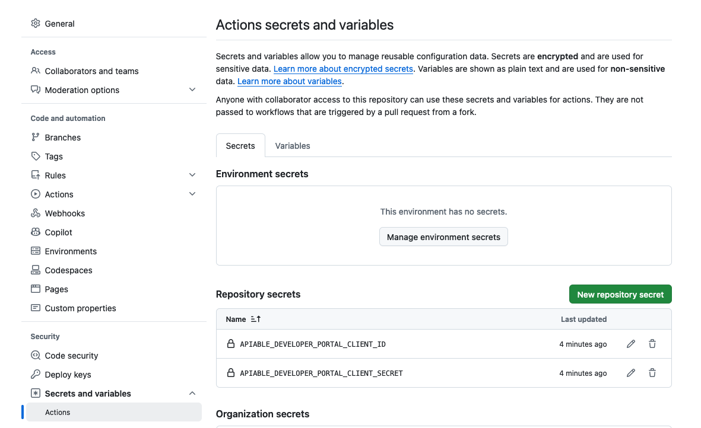

# Apiable GitHub Action

This custom GitHub Action allows you to automate interactions with the Apiable API, such as uploading OpenAPI specifications and updating documentation for a specified API plan.

## Features

- **JWT Authentication**: The action generates a JWT token by using the provided API credentials (`api_key` and `api_secret`).
- **OpenAPI Spec Upload**: It downloads the OpenAPI specification from the provided URL and uploads it to Apiable.
- **Documentation Update**: It updates the documentation URL for a specific documentation entry using a PATCH request.

## Inputs

This action requires the following inputs:

| Input              | Description                                                                                         | Required |
|--------------------|-----------------------------------------------------------------------------------------------------|----------|
| `api_key`          | The API key (client ID) to authenticate with Apiable.                                                | Yes      |
| `api_secret`       | The API secret (client secret) to authenticate with Apiable.                                         | Yes      |
| `api_url`          | The base URL of the Apiable API. Example: `https://dev.api.apiable.io`.                              | Yes      |
| `open_api_spec_url`| The URL of the OpenAPI specification to be uploaded. Example: `https://dev-api.apiable.io/api-docs`.  | Yes      |
| `docid`            | The ID of the documentation entry to update.                                                         | Yes      |

## Example Usage

Here’s an example GitHub Actions workflow that uses this custom action:

\`\`\`yaml
name: setup

on:
push:
branches:
- master
paths-ignore:
- '*.md'

jobs:
cicd:
runs-on: ubuntu-latest
steps:

      - name: Checkout
        uses: actions/checkout@v3

      - name: Run custom Apiable GitHub Action
        id: run-apiable-action@v2
        uses: ./@v2
        with:
          api_key: \${{ secrets.APIABLE_DEVELOPER_PORTAL_CLIENT_ID }}
          api_secret: \${{ secrets.APIABLE_DEVELOPER_PORTAL_CLIENT_SECRET }}
          api_url: "https://dev.api.apiable.io"
          open_api_spec_url: "https://dev-api.apiable.io/api/int/public/v3/api-docs"
          docid: "659fa46a2f08a41f65664bba"

      # Step 3: Get the output from the custom action
      - name: Get Action Output
        run: |
          echo "Action Response: \${{ steps.run-apiable-action@v2.outputs.response }}"
\`\`\`

### Explanation of the Example Workflow:

1. **Checkout the Repository**: The repository is checked out to access any necessary files or configurations.
2. **Run Apiable GitHub Action**: The custom action is executed with the provided API credentials, URLs, and documentation ID. Note the `@v2` suffix to use version 2 of the action.
3. **Display Action Output**: The response from the Apiable API is displayed as part of the workflow logs.

### Version History

- **v2**: Uses `docid` parameter and `PATCH /api/docs/{docId}` endpoint to update documentation URL
- **v1**: Uses `planid` parameter and `POST /api/plans/{planid}/docs` endpoint to create new documentation entries

## Setup and Secrets

To use this action in your workflow, make sure to provide the required environment variables (`APIABLE_DEVELOPER_PORTAL_CLIENT_ID` and `APIABLE_DEVELOPER_PORTAL_CLIENT_SECRET`) via GitHub Secrets for security:

1. Go to **Settings > Secrets and Variables > Actions** in your repository.
2. Add the following secrets:
  - `APIABLE_DEVELOPER_PORTAL_CLIENT_ID`: Your Apiable developer portal client ID.
  - `APIABLE_DEVELOPER_PORTAL_CLIENT_SECRET`: Your Apiable developer portal client secret.

Below are two screenshots to guide you through the setup:

### 1. Obtaining the Client ID and Secret

To get your `client_id` and `client_secret`, go to [Apiable Subscriptions](https://developer.apiable.io/subscriptions) and select your subscription. The masked example below shows where to find the Client ID and Secret.

### 2. Adding GitHub Secrets

Once you have the `client_id` and `client_secret`, add them to your repository’s secrets in GitHub as shown below.

## Outputs

| Output    | Description                                    |
|-----------|------------------------------------------------|
| `response`| The response from the Apiable API after updating the documentation. |

## License

This project is licensed under the MIT License.
